<p align="center"></p>

<p align="center">
  <i>Cybersecurity &amp; cloud computing engineering student with a passion for building and breaking systems — and a soft spot for ERPs that actually ship.</i>
</p>

<p align="center">
  <a href="https://mohamed-ben-naima.netlify.app/"></a>
  <a href="https://www.linkedin.com/in/mohamed-ben-naima"></a>
  <a href="https://raw.githubusercontent.com/{{OWNER}}/{{REPO}}/main/cv.pdf"></a>
</p>

<p align="center">
  <sub>📍 <b>Mahdia, Tunisia</b> &nbsp;·&nbsp; 🎓 <b>Seeking a PFE internship</b> &nbsp;·&nbsp; 🚀 <b>Shipping Microtiss Confect &amp; Hermes Suite</b></sub>
</p>

<p align="center"></p>

<p align="center"></p>

<!-- ─────────────────────────── STAGE 01 ─────────────────────────── -->

<p align="center"></p>

<p align="center"></p>

<details>
<summary><b>🕹️ Cheat code: <code>↑ ↑ ↓ ↓ ← → ← → B A</code></b> — click to unlock the player's lore</summary>
<br/>

```yaml
player:      Mohamed Ben Naima
class:       Sec-Dev            # builds it, then tries to break it
base:        Mahdia, Tunisia
school:      ESPRIM — engineering school
main_quest:  PFE internship — end-of-cycle engineering project
playstyle:
  - Ship real products for real businesses (ERP, invoicing, reporting)
  - Harden what ships: firewalls, VLANs, IAM, observability
  - Play CTFs and TryHackMe rooms for XP
party:       open to collaborations & CTF teammates
```

</details>

<p align="center"></p>

<!-- ─────────────────────────── STAGE 02 ─────────────────────────── -->

<p align="center"></p>

<table align="center">
  <tr>
    <td width="170" align="left" valign="top"><b>💻 Languages</b></td>
    <td align="left">
      
      
      
      
      
      
      
      
      
      
    </td>
  </tr>
  <tr>
    <td width="170" align="left" valign="top"><b>🎨 Frontend</b></td>
    <td align="left">
      
      
      
      
      
      
      
    </td>
  </tr>
  <tr>
    <td width="170" align="left" valign="top"><b>⚙️ Backend &amp; APIs</b></td>
    <td align="left">
      
      
      
      
      
      
    </td>
  </tr>
  <tr>
    <td width="170" align="left" valign="top"><b>☁️ Cloud · DevOps</b></td>
    <td align="left">
      
      
      
      
      
      
      
      
      
      
    </td>
  </tr>
  <tr>
    <td width="170" align="left" valign="top"><b>🗄️ Databases</b></td>
    <td align="left">
      
      
      
      
    </td>
  </tr>
</table>

<details>
<summary><b>🎒 Open the side pouch</b> — security tooling &amp; everyday workflow</summary>
<br/>
<p align="center">
  
  
  
  
  
  
  
  
  <br/>
  
  
  
  
  
  
  
  
</p>
<p align="center"><sub>Also fluent in: JWT · OAuth2 · RBAC · REST/OpenAPI</sub></p>
</details>

<p align="center"></p>

<!-- ─────────────────────────── STAGE 03 ─────────────────────────── -->

<p align="center"></p>

<p align="center"></p>

<p align="center">
  <sub>Some of my best work is private while it ships — check my pinned repos for what's public. 🍳</sub>
</p>

<p align="center"></p>

<!-- ─────────────────────────── STAGE 04 ─────────────────────────── -->

<p align="center"></p>

<p align="center"></p>

<p align="center"></p>

<!-- ─────────────────────────── STAGE 05 ─────────────────────────── -->

<p align="center"></p>

<p align="center">
  
  
</p>

<details>
<summary><b>📈 Expand the full scoreboard</b> — activity graph &amp; profile breakdown</summary>
<br/>
<p align="center">
  
</p>
<p align="center">
  
</p>
</details>

<p align="center"></p>

<!-- ─────────────────────────── STAGE 06 ─────────────────────────── -->

<p align="center"></p>

<p align="center"><sub>Every square is a day of commits. Pac-Man is hungry. 👻</sub></p>

<p align="center">
  <picture>
    <source media="(prefers-color-scheme: dark)" srcset="https://raw.githubusercontent.com/{{OWNER}}/{{REPO}}/output/pacman-contribution-graph-dark.svg" />
    <source media="(prefers-color-scheme: light)" srcset="https://raw.githubusercontent.com/{{OWNER}}/{{REPO}}/output/pacman-contribution-graph.svg" />
    
  </picture>
</p>

<details>
<summary><b>🐍 Insert another coin</b> — 2-player mode: the snake</summary>
<br/>
<p align="center">
  
</p>
</details>

<p align="center"></p>

<!-- ─────────────────────────── STAGE 07 ─────────────────────────── -->

<p align="center"></p>

<p align="center"></p>

<p align="center"></p>

<p align="center"></p>

<p align="center">
  <a href="https://mohamed-ben-naima.netlify.app/"></a>
  <a href="https://www.linkedin.com/in/mohamed-ben-naima"></a>
  <a href="https://raw.githubusercontent.com/{{OWNER}}/{{REPO}}/main/cv.pdf"></a>
  <a href="mailto:Medbennaima2021@gmail.com"></a>
  <a href="https://github.com/{{OWNER}}"></a>
  <a href="https://tryhackme.com/p/medbennaima2021"></a>
</p>

<p align="center">
  
</p>

<p align="center">
  <sub>Open to a PFE internship, collaborations and CTF partners — in Tunisia and beyond. ⚡</sub>
</p>
