<p align="center"></p>

<p align="center">
  <i>Full-stack engineer specialised in cybersecurity &amp; cloud — shipping secure web platforms, industrial ERPs and cloud-deployed infrastructure. I build systems, then try to break them.</i>
</p>

<p align="center">
  <a href="https://mohamed-ben-naima.netlify.app/"></a>
  <a href="https://www.linkedin.com/in/mohamed-ben-naima"></a>
  <a href="https://raw.githubusercontent.com/{{OWNER}}/{{REPO}}/main/cv.pdf"></a>
</p>

<p align="center">
  <sub>📍 <b>Mahdia, Tunisia</b> &nbsp;·&nbsp; 🎓 <b>ESPRIM — Cybersecurity &amp; Cloud</b> &nbsp;·&nbsp; 🏭 <b>Shipping Microtiss Confect ERP &amp; Hermes Suite</b> &nbsp;·&nbsp; 🎯 <b>Open to a PFE internship</b></sub>
</p>

<p align="center"></p>

<p align="center"></p>

<!-- ─────────────────────────── STAGE 01 ─────────────────────────── -->

<p align="center"></p>

<p align="center"></p>

<details>
<summary><b>🕹️ Cheat code: <code>↑ ↑ ↓ ↓ ← → ← → B A</code></b> — click to unlock the player's lore</summary>
<br/>

```yaml
player:      Mohamed Ben Naima
class:       Sec-Dev            # builds it, then tries to break it
base:        Mahdia, Tunisia
school:      ESPRIM Monastir — Cybersecurity & Cloud engineering (top of class)
languages:   [Arabic, French, English, German]
main_quest:  PFE internship — end-of-cycle engineering project
guilds:
  - Hunters Club      # co-founder, 20+ members, CTFs across Tunisia
  - DevTalents        # led the Cyber & Cloud committee, 30+ members
certs:       [CLLMSP, CRTOM, "CCNA 200-301 (in progress)", "Building AI Agents", n8n]
playstyle:
  - Ship real products for real businesses (ERP, e-commerce, trading)
  - Harden what ships: firewalls, VLANs, IAM, observability
  - Farm XP in CTFs and hackathons
party:       open to collaborations & CTF teammates
```

</details>

<p align="center"></p>

<!-- ─────────────────────────── STAGE 02 ─────────────────────────── -->

<p align="center"></p>

<p align="center"></p>

<p align="center"></p>

<!-- ─────────────────────────── STAGE 03 ─────────────────────────── -->

<p align="center"></p>

<p align="center"></p>

<p align="center">
  <sub>Most of this work is private while it ships — check my pinned repos for what's public. 🍳</sub>
</p>

<p align="center"></p>

<!-- ─────────────────────────── STAGE 04 ─────────────────────────── -->

<p align="center"></p>

<p align="center"></p>

<p align="center"></p>

<!-- ─────────────────────────── STAGE 05 ─────────────────────────── -->

<p align="center"></p>

<p align="center"></p>

<p align="center"></p>

<!-- ─────────────────────────── STAGE 06 ─────────────────────────── -->

<p align="center"></p>

<p align="center"></p>

<p align="center"></p>

<!-- ─────────────────────────── STAGE 07 ─────────────────────────── -->

<p align="center"></p>

<p align="center"><sub>Every square is a day of commits. Pac-Man is hungry. 👻</sub></p>

<p align="center">
  <picture>
    <source media="(prefers-color-scheme: dark)" srcset="https://raw.githubusercontent.com/{{OWNER}}/{{REPO}}/output/pacman-contribution-graph-dark.svg" />
    <source media="(prefers-color-scheme: light)" srcset="https://raw.githubusercontent.com/{{OWNER}}/{{REPO}}/output/pacman-contribution-graph.svg" />
    
  </picture>
</p>

<details>
<summary><b>🐍 Insert another coin</b> — 2-player mode: the snake</summary>
<br/>
<p align="center">
  
</p>
</details>

<p align="center"></p>

<!-- ─────────────────────────── STAGE 08 ─────────────────────────── -->

<p align="center"></p>

<p align="center"></p>

<p align="center"></p>

<p align="center"></p>

<p align="center">
  <a href="https://mohamed-ben-naima.netlify.app/"></a>
  <a href="https://www.linkedin.com/in/mohamed-ben-naima"></a>
  <a href="https://raw.githubusercontent.com/{{OWNER}}/{{REPO}}/main/cv.pdf"></a>
  <br/>
  <a href="mailto:Medbennaima2021@gmail.com"></a>
  <a href="https://github.com/{{OWNER}}"></a>
  <a href="https://tryhackme.com/p/medbennaima2021"></a>
</p>

<p align="center">
  
</p>

<p align="center">
  <sub>Open to a PFE internship, collaborations and CTF partners — in Tunisia and beyond. ⚡</sub>
</p>
